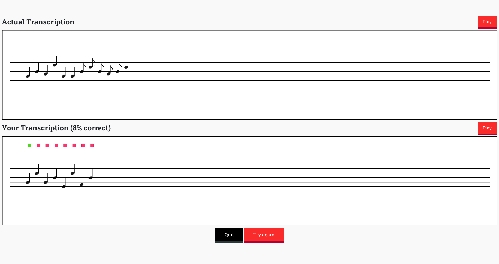

# Transcriboid (front-end)

Transcriboid is a musical training web application that I developed over the summer of 2019. It generates melodies by analyzing patterns in midi files, challenges the user to discern the rhythms and melodies using only their ears, and gives them feedback on how accurately they transcribed the melody. You can check it out at [transcriboid.ethanleba.com](transcriboid.ethanleba.com).

This repository contains the front-end interface for my project transcriboid, written using React.js and Bootstrap. It takes in data from the backend using a RESTful API, plays the melodies, and provides the sheet music interface.

## Getting Started

These instructions will get you a copy of the project up and running on your local machine for development and testing purposes. See deployment for notes on how to deploy the project on a live system.

### Prerequisites

NPM - Can be installed [here](https://www.npmjs.com/).

### Installing

To build the project in a development environment, you can run:

### `npm start`

Runs the app in the development mode. 
Open [http://localhost:3000](http://localhost:3000) to view it in the browser.

You will also need to set the proxy in _package.json_ to point to your RESTful API.

The page will reload if you make edits. 
You will also see any lint errors in the console.

### `npm run build`

Builds the app for production to the `build` folder. 
It correctly bundles React in production mode and optimizes the build for the best performance.

The build is minified and the filenames include the hashes. 
Your app is ready to be deployed!

See the section about [deployment](https://facebook.github.io/create-react-app/docs/deployment) for more information.

### `npm run eject`

## Deployment

This project is deployed on Heroku, using [heroku-buildpack-static](https://github.com/heroku/heroku-buildpack-static). No changes are needed to deploy the project on Heroku. You can specify your own backend by modifying the proxy in static.json.

## Built With

- [React.js](https://reactjs.org) - The web framework used
- [Bootstrap](https://getbootstrap.com/) - CSS library
- [Tone.js](https://tonejs.github.io) - used for audio display
- [react-router-dom](https://reacttraining.com/react-router/web/guides/quick-start) - used for moving between pages
- [Axios](https://github.com/axios/axios) - Used for HTTP requests
- [Snap SVG](http://snapsvg.io/) - Used for SVG display

## License

This project is licensed under the MIT License - see the [LICENSE.md](LICENSE.md) file for details

#### Created by Ethan Leba
